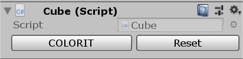
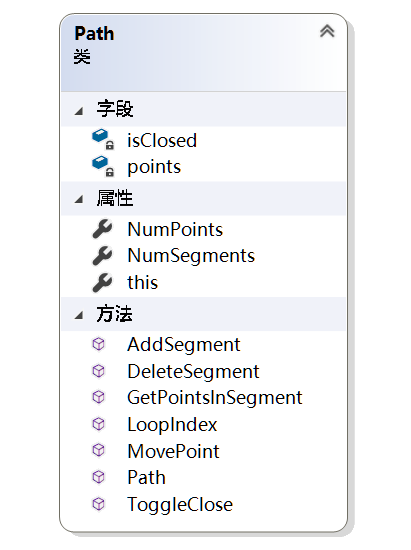
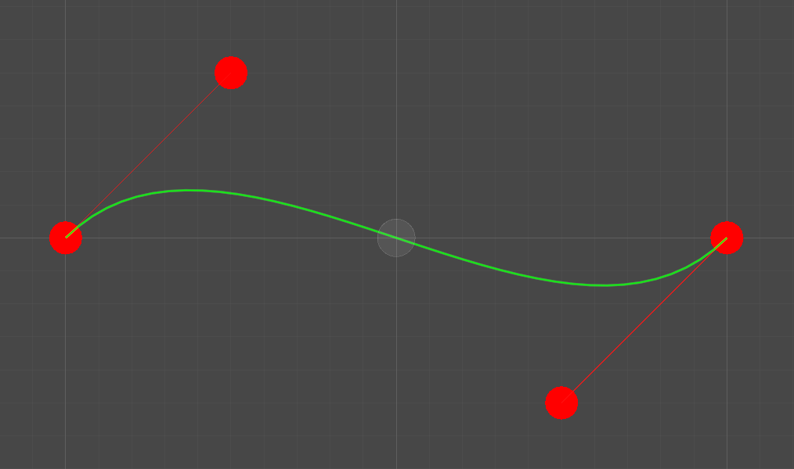
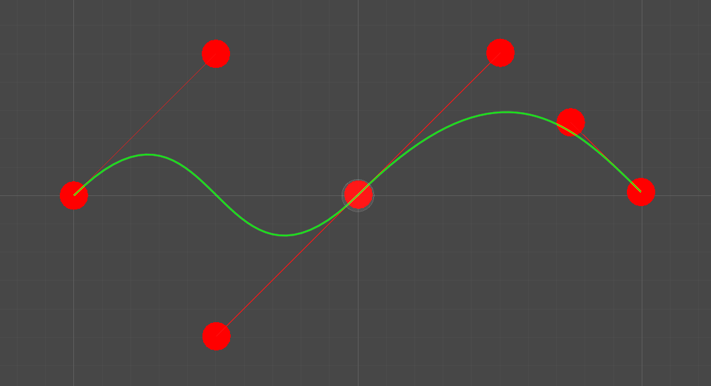

# Hello Editor

> Unity Editor

## Custom Inspector

对 `Cube` 脚本自定义 `Inspector`，可随机改变方块颜色与重置。(`Scenes/CubeEditorSample`)



## 曲线编辑器

### 已实现的功能

- 创建曲线
- <kbd>Shift</kbd> + 左键 添加节点
- 右键 删除节点
- 移动节点，锚点跟随
- 调整锚点，对应锚点方向跟随
- 按住 <kbd>Ctrl</kbd> 自由调整单个锚点
- 曲线闭合，首尾相接

### 部分具体实现

#### 1. Path

曲线内部维护一个 `Vecotr2` 的 `List`（**`points`**），节点**按顺序**放置在 `points` 中。



#### 2. 创建曲线

创建曲线的方法由 `PathCreator` 提供，`PathCreator` 可挂载在游戏物体上，创建曲线即将 `PathCreator` 内部包含的 `Path` 实例化，并传入游戏物体的坐标作为初始位置（`center`）。

创建的新曲线为一段，两个节点，共四个点。图中从左到右的顺序为 `0、1、2、3`，坐标分别为 `center` 的左侧一个单位的位置、左`0.5`上`0.5`单位的位置、右`0.5`下`0.5`单位的位置、右一个单位的位置。

```c#
public Path(Vector2 center) {
    points = new List<Vector2>() {
        center + Vector2.left,
        center + (Vector2.left + Vector2.up) * 0.5f,
        center + (Vector2.right + Vector2.down) * 0.5f,
        center + Vector2.right
    };
}
```



#### 3. 添加节点

添加一个节点即添加一个曲线段需要添加 **3** 个点，图中（*除默认曲线的 4 个点外*）从左到右的顺序为 `4、5、6`。

这三个点的位置分别为 `points[2]` 相对于 `points[3]` 的对称点、`points[6]` 即添加节点位置与 `points[4]` 的中点、添加的节点位置。

```c#
public void AddSegment(Vector2 seg) {
    points.Add(points[points.Count - 1] * 2 - points[points.Count - 2]);
    points.Add((points[points.Count - 1] + seg) / 2);
    points.Add(seg);
}
```



#### 4. 删除节点

- 普通情况（删除中间某个节点）：只需删除节点左右两个点和节点本身，使用 `points.RemoveRange(index - 1, 3)` 即可。 
- 删除**首**节点：如果曲线未闭合则只需删除 `points` 的前三个点，即上图中的 `0、1、2`。如果曲线闭合则在删除这三个点之前将最后一个点的值改为 `points[2]` 即新的首节点的第一个锚点。
- 删除**尾**节点：如果未闭合则需删除 `points` 的最后三个点，即上图中的 `4、5、6` ，使新的尾节点只有一个锚点。如果曲线闭合，则不需删除新的尾节点的第二锚点，而需要删除最后一个点（首节点的一个锚点）。

```c#
public void DeleteSegment(int index) {
    if (NumSegments <= 2 && (isClosed || NumSegments <= 1))
        return;

    if (index == 0) {
        if (isClosed)
            points[points.Count - 1] = points[2];
        points.RemoveRange(0, 3);
    }
    else if (index == points.Count - 1 && !isClosed) {
        points.RemoveRange(index - 2, 3);
    }
    else {
        points.RemoveRange(index - 1, 3);
    }
}
```

#### 5. 移动节点

- 单纯移动点的部分只需将坐标赋值给对应点即可。
- 移动**节点**时还要将对应的两个**锚点**同时移动，使其保持相对位置。
- 移动**锚点**时如果没有按下 <kbd>Ctrl</kbd> 则要将所相对的锚点同时移动，保持方向相对，但对面锚点到节点的距离不变。

```c#
public void MovePoint(int i, Vector2 pos) {
    Vector2 offset = pos - points[i];
    points[i] = pos;

    switch (i % 3) {
        case 0:
            if (i - 1 >= 0 || isClosed)
                points[LoopIndex(i - 1)] += offset;
            if (i + 1 < NumPoints || isClosed)
                points[LoopIndex(i + 1)] += offset;
            break;
        case 1:
            if ((i - 2 >= 0 || isClosed) && !Event.current.control) {
                float dst = (points[LoopIndex(i - 1)] - points[LoopIndex(i - 2)]).magnitude;
                Vector2 dir = (points[LoopIndex(i - 1)] - pos).normalized;
                points[LoopIndex(i - 2)] = points[LoopIndex(i - 1)] + dir * dst;
            }
            break;
        case 2:
            if ((i + 2 < NumPoints || isClosed) && !Event.current.control) {
                float dst = (points[LoopIndex(i + 1)] - points[LoopIndex(i + 2)]).magnitude;
                Vector2 dir = (points[LoopIndex(i + 1)] - pos).normalized;
                points[LoopIndex(i + 2)] = points[LoopIndex(i + 1)] + dir * dst;
            }
            break;
        default:
            break;
    }
}
```

#### 6. 闭合曲线

闭合曲线通过一个按钮来控制闭合和开放，变量 `isClosed` 记录状态。闭合曲线需要在 `points` 最后增加两个点，即首尾节点的锚点，取消闭合则删除这两个点。

```c#
public void ToggleClose() {
    isClosed = !isClosed;

    if (isClosed) {
        points.Add(points[points.Count - 1] * 2 - points[points.Count - 2]);
        points.Add(points[0] * 2 - points[1]);
    }
    else {
        points.RemoveRange(points.Count - 2, 2);
    }
}
```

#### 7. 曲线和锚点的绘制

曲线和锚点的绘制放在了一个 `Draw()` 函数中，`Draw()` 函数在 `PathEditor` 的 `OnSceneGUI()` 中调用。

- 锚点的绘制用到了 `Handles` 类中的 `FreeMoveHandle()` 方法来绘制了一个圆柱形手柄，手柄移动后的位置返回给 `pos` ，通过这个返回的 `pos` 来移动点。在移动之前用 `Undo` 类记录了当前状态，可以撤销这一步的移动。
- 曲线的绘制用到了 `Path` 类中的 `GetPointsInSegment(int)` 方法来获取某一段曲线的**四**个控制点，`0、1` 两个点连线，`2、3` 两个点连线，然后利用这四个点绘制一条从 `0` 到 `3` 的贝塞尔曲线。

```c#
private void Draw() {
    // 绘制锚点
    Handles.color = Color.red;
    for(int i = 0; i < path.NumPoints; i++) {
        Vector2 pos = Handles.FreeMoveHandle(path[i], Quaternion.identity, 0.1f, Vector3.zero, Handles.CylinderHandleCap);
        if (pos != path[i]) {
            Undo.RecordObject(creator, "移动锚点");
            path.MovePoint(i, pos);                        
        }
    }

    // 绘制曲线
    for(int i = 0; i < path.NumSegments; i++) {
        Vector2[] points = path.GetPointsInSegment(i);
        Handles.DrawLine(points[0], points[1]);
        Handles.DrawLine(points[2], points[3]);
        Handles.DrawBezier(points[0], points[3], points[1], points[2], Color.green, null, 4f);
    }
}
```


#### 8. 鼠标点击控制

鼠标左键和右键分别有添加、删除节点的作用，`Editor` 中的鼠标输入需要用 `Event` 事件，如**左键点击**的判断： `guiEvent.type == EventType.MouseDown && guiEvent.button == 0`，而 <kbd>Shift</kbd> 的状态只需 `guiEvent.shift` 即可，其中 `guiEvent` 为 `Event.current`。

**鼠标位置**：`Vector2 mousePos = HandleUtility.GUIPointToWorldRay(guiEvent.mousePosition).origin`。

**右键删除节点**时需要遍历所有节点，比较鼠标位置与节点坐标距离，小于一定值才判断为点击的节点，再将其删除。

添加和删除节点都利用 `Undo` 类记录了状态，都可以 <kbd>Ctrl</kbd> + <kbd>Z</kbd> **撤销操作**。

#### 9. Inspector GUI

在`PathCreator` 的 `Inspector` 上添加了两个按钮：<kbd>创建新曲线</kbd> 和 <kbd>闭合/打开曲线</kbd> ，只需要将继承了 `Editor` 的 `PathEditor` 覆写 `OnInsepectorGUI()` 方法，在基类方法的基础上添加这两个按钮。点击按钮后通过 `SceneView` 类的 `RepaintAll()` 方法重新绘制。

```c#
public override void OnInspectorGUI() {
    base.OnInspectorGUI();

    if (GUILayout.Button("创建新曲线")) {
        creator.CreatePath();
        path = creator.path;
        SceneView.RepaintAll();
    }

    if (GUILayout.Button("闭合/打开曲线")) {
        path.ToggleClose();
        SceneView.RepaintAll();
    }
}
```

